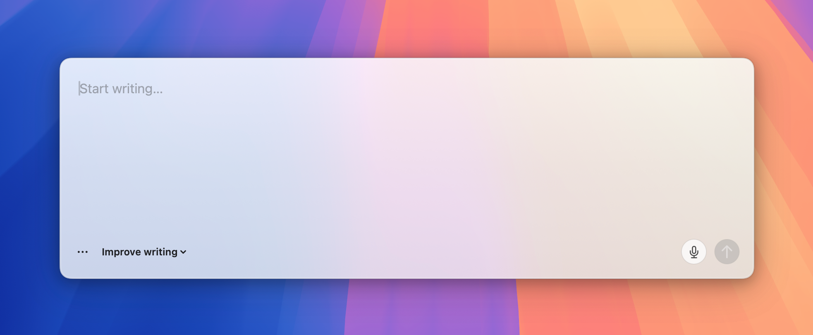
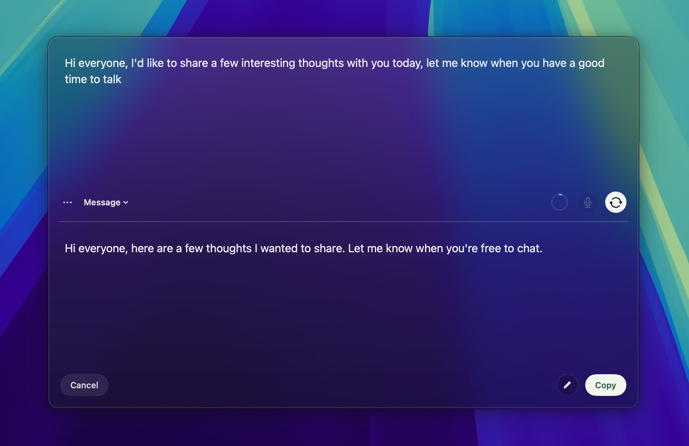

# Snapdraft

Snapdraft is a local-first macOS drafting overlay for polishing messages without leaving the app you are already using.

Open it on top of any other Mac app. Draft, rewrite, dictate, preserve formatting, and copy.

  <a href="https://ranyitz.github.io/snapdraft/">Website</a> |
  <a href="https://github.com/ranyitz/snapdraft/releases/latest/download/Snapdraft.dmg">Download</a> |
  <a href="PRIVACY.md">Privacy</a>

## Why Snapdraft

Everyday writing happens in small boxes across a dozen tools. Opening a chatbot for every rewrite adds friction, loses formatting, and scatters drafts.

Snapdraft keeps the writing flow where it belongs:

- Open a drafting overlay from anywhere on your Mac.
- Rewrite with built-in modes like Fix errors, Improve writing, Email, and Message.
- Create custom rewrite modes for the way you actually communicate.
- Preserve bullets, links, bold, italics, code, and paragraph structure.
- Dictate into apps that do not have their own microphone input.
- Keep draft history locally, so unfinished writing does not disappear.

## Local-First

Snapdraft is built around keeping your writing on your machine.

- Rewriting runs locally through `llama.cpp`.
- Transcription runs locally through `whisper.cpp`.
- Draft history is stored on your Mac.
- Models download on first use and are cached locally.

Read the full [privacy policy](PRIVACY.md).

## Install

1. Download the latest [`Snapdraft.dmg`](https://github.com/ranyitz/snapdraft/releases/latest/download/Snapdraft.dmg).
2. Open the DMG.
3. Drag `Snapdraft.app` into `Applications`.
4. Launch Snapdraft from `Applications`.
5. Press `Cmd + Shift + Space` to open the drafting overlay.

Snapdraft requires macOS 13.3 or later and Apple silicon.

## Support

For installation problems, bugs, or feature requests, [open an issue](https://github.com/ranyitz/snapdraft/issues).

## License

Snapdraft is proprietary freeware — free to download and use for personal use. See the [EULA](EULA.md) for the full terms.
